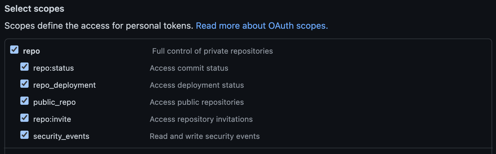

# mkrep

> Create your local & Github repository instantly

## ✅ Requirements

- NodeJS
- Git

## ⚙️ Setup

1. Create a Github personal access token [here](https://github.com/settings/tokens) with the following scopes: 

2. Install `mkrep`

```sh
npm i -g mkrep
```

3. Create a project `mkrep create my-new-project`, CLI will ask you to enter your Github personal access token & default directory to create the new `mkrep` projects

## ✨ Usage

```sh
mkrep create my-new-project
```

## 🤔 Why ?

`mkrep` automate the creation of a new Git project hosted on Github.

### Without mkrep

```sh
$ mkdir my-new-project
$ cd my-new-project
$ git init
$ npm init -y
$ git add . && git commit -m "Initial commit"

# Going to Github.com to create a new repository
# Copy new repository URL

$ git remote add origin git@github.com:username/my-new-project.git
$ git push -u origin main
```

### With mkrep

```sh
mkrep create my-new-project
```

## ⚖️ License

MIT. Made with 💖
